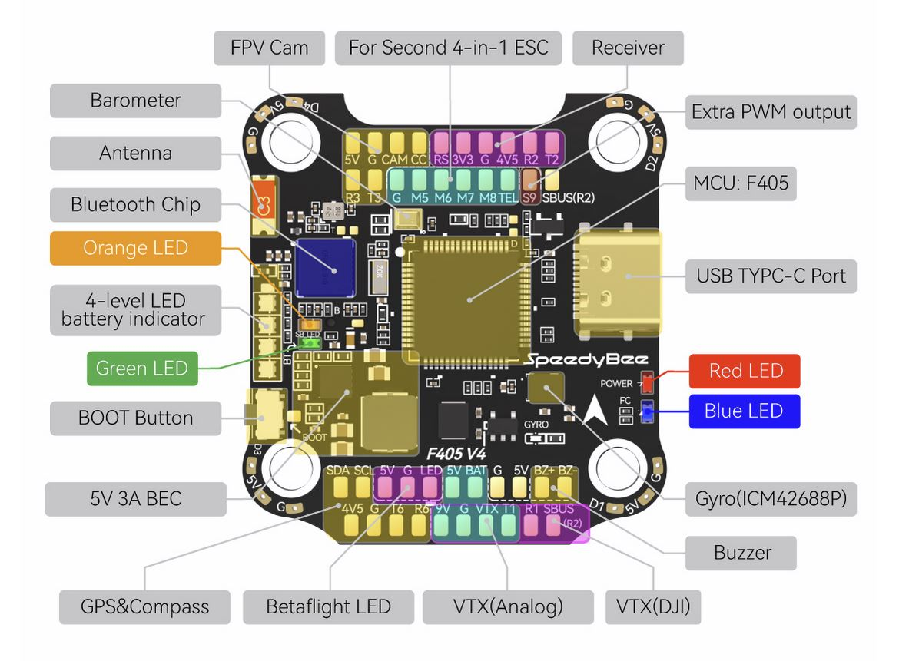
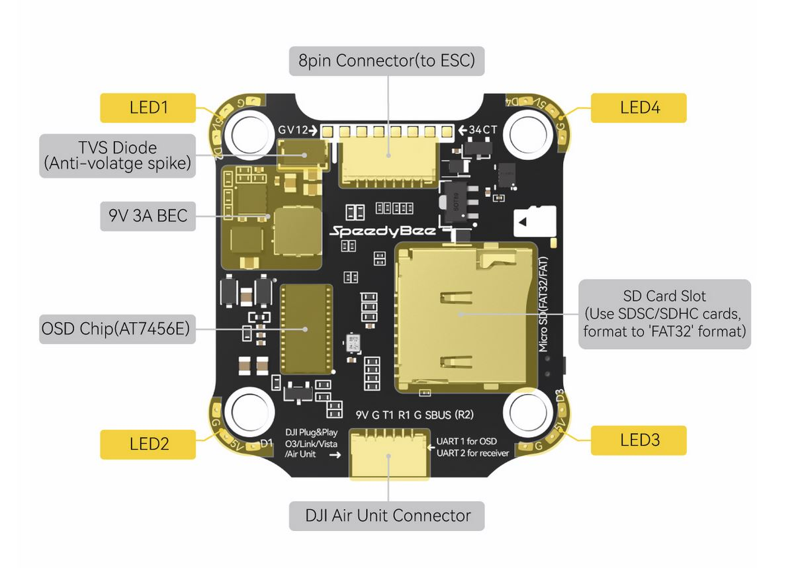

# SpeedyBee F405 v4 Flight Controller

The SpeedyBee F405 v4 is a flight controller produced by [SpeedyBee](http://www.speedybee.com/).

## Features

 - STM32F405 microcontroller
 - ICM42688 IMU
 - DPS310 barometer
 - SDCard
 - AT7456E OSD
 - 6 UARTs
 - 9 PWM outputs

## Pinout

## UART Mapping

The UARTs are marked Rn and Tn in the above pinouts. The Rn pin is the
receive pin for UARTn. The Tn pin is the transmit pin for UARTn.

 - SERIAL0 -> USB
 - SERIAL1 -> UART1 (DJI-VTX, DMA-enabled)
 - SERIAL2 -> UART2 (RCIN, DMA-enabled) 
 - SERIAL3 -> UART3 (CAM)
 - SERIAL4 -> UART4 (connected to internal BT module, not currently usable by ArduPilot)
 - SERIAL5 -> UART5 (ESC Telemetry)
 - SERIAL6 -> UART6 (GPS, DMA-enabled)

## RC Input

RC input is configured on the R2 (UART2_RX) pin for most RC unidirectional protocols except SBUS which should be applied at the SBUS pin. PPM is not supported.
For Fport, a bi-directional inverter will be required. See https://ardupilot.org/plane/docs/common-connecting-sport-fport.html
For CRSF/ELRS/SRXL2 connection of the receiver to T2 will also be required.
 
## FrSky Telemetry
 
FrSky Telemetry is supported using the Tx pin of any UART including SERIAL2/UART2. You need to set the following parameters to enable support for FrSky S.PORT (example shows SERIAL3).
 
  - SERIAL3_PROTOCOL 10
  - SERIAL3_OPTIONS 7
  
## OSD Support

The SpeedyBee F405 v4 supports OSD using OSD_TYPE 1 (MAX7456 driver).

## VTX Support

The JST-GH-6P connector supports a standard DJI HD VTX connection. Pin 1 of the connector is 9v so be careful not to connect
this to a peripheral requiring 5v.

## PWM Output

The SpeedyBee F405 v4 supports up to 9 PWM outputs. The pads for motor output
M1 to M4 on the motor connector, plus M9 for LED strip or another
PWM output.

The PWM is in 5 groups:

 - PWM 1-2 in group1
 - PWM 3-4 in group2
 - PWM 5-6 in group3
 - PWM 7-8 in group4
 - PWM 9 in group5

Channels within the same group need to use the same output rate. If
any channel in a group uses DShot then all channels in the group need
to use DShot. Channels 1-4 support bi-directional DShot.

## Battery Monitoring

The board has a internal voltage sensor and connections on the ESC connector for an external current sensor input.
The voltage sensor can handle up to 6S.
LiPo batteries.

The default battery parameters are:

 - BATT_MONITOR 4
 - BATT_VOLT_PIN 10
 - BATT_CURR_PIN 11
 - BATT_VOLT_MULT 11.2
 - BATT_AMP_PERVLT 52.7 (will need to be adjusted for whichever current sensor is attached)

## Compass

The SpeedyBee F405 v4 does not have a builtin compass, but you can attach an external compass using I2C on the SDA and SCL pads.

## Loading Firmware

Initial firmware load can be done with DFU by plugging in USB with the
bootloader button pressed. Then you should load the "with_bl.hex"
firmware, using your favourite DFU loading tool.

Once the initial firmware is loaded you can update the firmware using
any ArduPilot ground station software. Updates should be done with the
*.apj firmware files.

