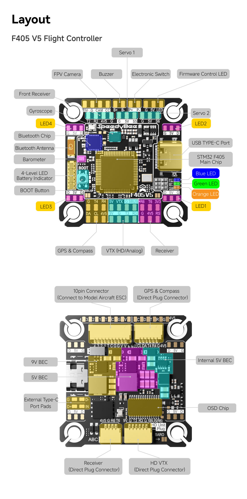

# SpeedyBee F405 v5 Flight Controller

The SpeedyBee F405 V5 is a flight controller produced by [SpeedyBee](http://www.speedybee.com/).

## Features

-   MCU: STM32F405 32-bit processor. 1024Kbytes Flash
-   IMU: ICM-42688P (SPI)
-   Barometer: SPA06-003
-   USB VCP Driver (all UARTs usable simultaneously; USB does not take up a UART)
-   6 UARTS (UART1 tied internally to BT module which is not currently supported by ArduPilot)
-   16MBytes for logging

## Pinout

## UART Mapping

The UARTs are marked Rn and Tn in the above pinouts. The Rn pin is the
receive pin for UARTn. The Tn pin is the transmit pin for UARTn.

-   SERIAL0 -> USB
-   SERIAL1 -> UART1 (connected to internal BT module, not currently usable by ArduPilot)
-   SERIAL2 -> UART2
-   SERIAL3 -> UART3 (DJI-VTX)
-   SERIAL4 -> UART4 (GPS)
-   SERIAL5 -> UART5 (ESC Telemetry)
-   SERIAL6 -> UART6 (RCIN)

## RC Input

RC input is configured on the R6 (UART6_RX) pin for most RC unidirectional protocols except SBUS which should be applied at the SBUS pin. PPM is not supported.
For Fport, a bi-directional inverter will be required. See https://ardupilot.org/plane/docs/common-connecting-sport-fport.html

SBUS is supported. When using an SBUS receiver, the SBUS jumper pad on the flight controller must be soldered. The signal uses hardware inversion and is connected to USART6_RX. SBUS is available on both a dedicated solder pad and the DJI HD connector.

## FrSky Telemetry

FrSky Telemetry is supported using the Tx pin of any UART including SERIAL6/UART6. You need to set the following parameters to enable support for FrSky S.PORT (example shows SERIAL3).

-   SERIAL3_PROTOCOL 10
-   SERIAL3_OPTIONS 7

## OSD Support

The SpeedyBee F405 v5 supports OSD using :ref:`OSD_TYPE<OSD_TYPE>` = 1 (MAX7456 driver). Simultaneous DisplayPort OSD operation is also pre-configured via UART3. See :ref:`common-msp-osd-overview-4.2` for more info.

## VTX Support

The JST-GH-6P connector supports a standard DJI HD VTX connection. Pin 1 of the connector is 9v so be careful not to connect
this to a peripheral requiring 5v.

## PWM Output

The SpeedyBee F405 v5 supports up to 7 PWM outputs. The pads for motor output
M1 to M4 on the motor connector, plus M7 for LED strip or another
PWM output.

The PWM is in 5 groups:

-   PWM 1-2 in group1
-   PWM 3-4 in group2
-   PWM 5-6 in group3 (SERVO pads S5,S6)
-   PWM 7 in group4 (LED pad)

Channels within the same group need to use the same output rate. If
any channel in a group uses DShot then all channels in the group need
to use DShot. Channels 1-4 support bi-directional DShot.

## Battery Monitoring

The board has a internal voltage sensor and connections on the ESC connector for an external current sensor input.
The voltage sensor can handle up to 6S.
LiPo batteries.

The default battery parameters are:

-   :ref:`BATT_MONITOR<BATT_MONITOR>` = 4
-   :ref:`BATT_VOLT_PIN<BATT_VOLT_PIN__AP_BattMonitor_Analog>` = 11
-   :ref:`BATT_CURR_PIN<BATT_CURR_PIN__AP_BattMonitor_Analog>` = 15 (CURR pin)
-   :ref:`BATT_VOLT_MULT<BATT_VOLT_MULT__AP_BattMonitor_Analog>` = 11.2
-   :ref:`BATT_AMP_PERVLT<BATT_AMP_PERVLT__AP_BattMonitor_Analog>` = 1 (will need to be adjusted for whichever current sensor is attached)

## RSSI

-   ADC Pin 10 -> RSSI voltage monitoring

## Compass

The SpeedyBee F405 v5 does not have a builtin compass, but you can attach an external compass using I2C on the SDA and SCL pads.

## Camera Control

The CC pin is a GPIO (pin 70) and is assigned by default to RELAY2 functionality. This pin can be controlled via GCS or by RC transmitter using the :ref:`Auxiliary Function<common-auxiliary-functions>` feature.

## VTX power control

GPIO 71 controls the VTX BEC output to pins marked "9V". Setting this GPIO high removes voltage supply to pins.

By default RELAY3 is configured to control this pin and sets the GPIO low. This pin can be controlled via GCS or by RC transmitter using the :ref:`Auxiliary Function<common-auxiliary-functions>` feature.

## Programmable Power Switch

GPIO 72 controls the programmable switch labeled “P+ / P−”, P- is connected to GND. P+ outputs 5V. Setting this GPIO low disables the voltage supply to the P+ pin.

By default, RELAY4 is configured to control this GPIO and keeps it low.This pin can be controlled via GCS or by RC transmitter using the :ref:`Auxiliary Function<common-auxiliary-functions>` feature.

## Firmware

Firmware for this board can be found: `here <https://firmware.ardupilot.org>`__ in sub-folders labeled “speedybeef4v5”.

## Loading Firmware (you will need to compile your own firmware)

Initial firmware load can be done with DFU by plugging in USB with the
bootloader button pressed. Then you should load the "with_bl.hex"
firmware, using your favourite DFU loading tool.

Once the initial firmware is loaded you can update the firmware using
any ArduPilot ground station software. Updates should be done with the
\*.apj firmware files.
