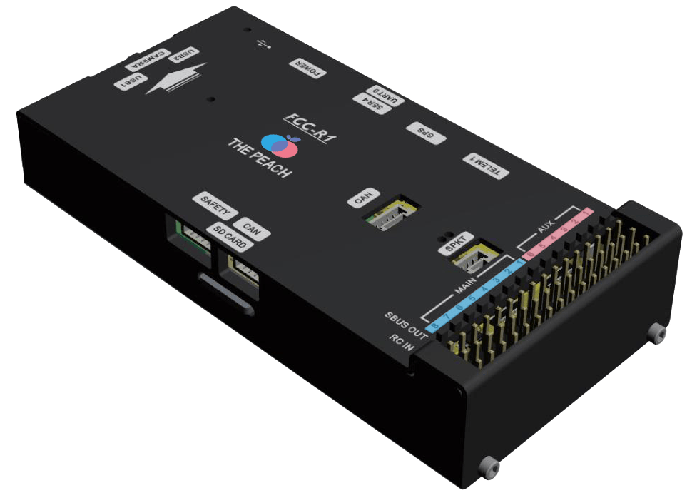
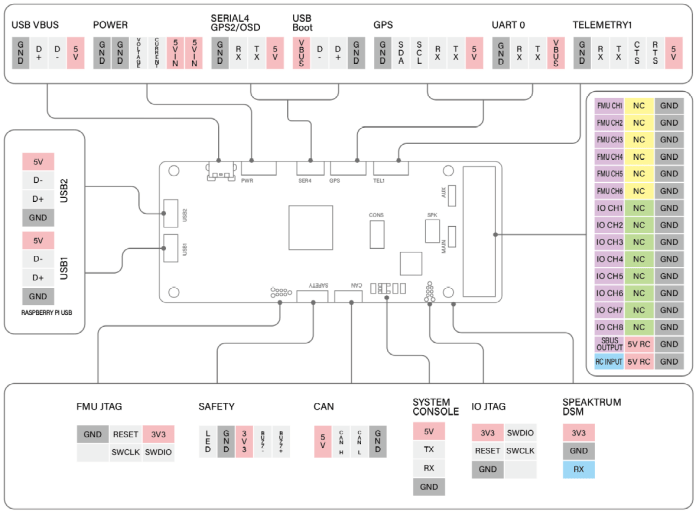

# ThePeach FCC-R1

:::warning
Ardupilot does not manufacture this (or any) autopilot. 
Contact the [manufacturer](https://thepeach.kr/) for hardware support or compliance issues.
:::

**ThePeach FCC-R1** is an advanced autopilot designed and made in **ThePeach**.

## Specifications

- Main Processor: STM32F427VIT6
  - 32bit ARM Cortex-M4, 168 MHz 256 KB RAM 2 MB Flash memory

- IO Processor: STM32F100C8T6
  - ARM Cortex-M3, 32bit ARM Cortex-M3, 24 MHz, 8KB SRAM

- On-board sensors
  - Accel/Gyro: ICM-20602
  - Accel/Gyro/Mag: MPU-9250
  - Barometer: MS5611

- Interfaces
  - 8+6 PWM output (8 from IO, 6 from FMU)
  - Spektrum DSM / DSM2 / DSM-X Satellite compatible input
  - Futaba S.BUS compatible input and output
  - PPM sum signal input
  - Analogue / PWM RSSI input
  - S.Bus servo output
  - Safety switch/LED
  - 4x UART: TELEM1, TELEM2(Raspberry Pi CM3+), GPS, SERIAL4
  - 1x I2C Ports
  - 1x CAN bus
  - Analog inputs for voltage / Current of 1 battery

- Interfaces For Raspberry Pi CM3+
  - VBUS
  - DDR2 Connector: Raspberry Pi CM3+
  - 1x UART
  - 2x USB
  - 1x Raspberry Pi Camera

- Mechanical
  - Dimensions: 49.2 x 101 x 18.2mm
  - Weight: 100g

## Connectors

## Serial Port Mapping

| UART   | Device     | Port                       |
| ------ | ---------- | -------------------------- |
| USART1 | /dev/ttyS0 | IO Processor Debug         |
| USART2 | /dev/ttyS1 | TELEM1 (flow control)      |
| USART3 | /dev/ttyS2 | TELEM2 (Raspberry pi cm3+) |
| UART4  | /dev/ttyS3 | GPS1                       |
| USART6 | /dev/ttyS4 | PX4IO                      |
| UART7  | /dev/ttys5 | Debug console              |
| UART8  | /dev/ttyS6 | TELEM4                     |

## Voltage Ratings

**ThePeach FCC-R1** can be double-redundant on the power supply if two power sources are supplied. The two power rails are: **POWER** and **USB**.

Note:

1. The output power rails **FMU PWM OUT** and **I/O PWM OUT** do not power the flight controller board (and are not powered by it). You must supply power to one of **POWER** or **USB** or the board will be unpowered.
2. The USB do not power the **Raspberry Pi CM3+**. You must supply power to **POWER** or the Raspberry Pi CM3+ will be unpowered.

**Normal Operation Maximum Ratings**

Under these conditions, all power sources will be used in this order to power the system:

1. POWER input (5V to 5.5V)
2. USB input (4.75V to 5.25V)

**Absolute Maximum Ratings**

Under these conditions, all power sources cause permanent damage to the flight controller.

1. POWER input (5.5V Over)

2. USB input (5.5V Over)

## Where to buy

Order from [ThePeach](http://thepeach.shop/)