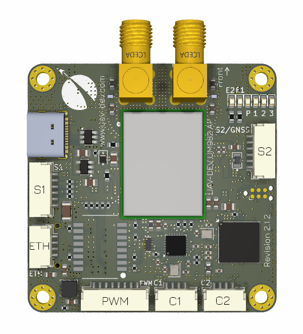

# UAV-DEV-FC-UM982 Flight Controller with RTK GNSS and GNSS Heading capability via dual-antenna setup

The UAV-DEV-FC-UM92 Flight Controller is sold by [UAV-DEV GmbH Webshop](https://shop.uav-dev.com/)

## Features
#### Processor
- STM32H743
- 480MHz
- 2MB Flash
- 1MB RAM
#### Sensors
- IMU TDK Invensense ICM-45686
- Barometer Infineon DPS310
- Magnetometer Bosch BMM150
- GNSS Unicore UM982 L1/L2/L5 RTK GNSS with GNSS Heading
#### Dimensions
- Size: 50mm x 50mm (without SMA connector) x 15mm
- Weight: 22g with microSD card
#### Power
- 5.2V input via JST-GH
#### Interfaces
- **USB-C**
- **Ethernet**
  - 100 MBit/s
- **PWM**
  - 6 x PWM / DShot, 2 x Bidirectional-DShot capable
- **RC Input**
  - UART
- **TELEM**
  - Serial or Ethernet
- **CAN**
  - 2 x FD CAN with 120 Ohm resistor
- **microSD**
- **DEBUG**
  - Tag-Connect

## Pinout

#### S1 - SERIAL4 & SERIAL5 - 6 Pin JST-GH
| Pin | Signal Name     | Voltage      |
|-----|-----------------|--------------|
| 1   | +5V             | 5V           |
| 2   | USART6_TX       | 3.3V         |
| 3   | USART6_RX       | 3.3V         |
| 4   | UART7_TX        | 3.3V         |
| 5   | UART7_RX        | 3.3V         |
| 6   | GND             | GND          |

#### PWM - PWM / DShot / Telemetry - 8 Pin JST-GH
| Pin | Signal Name           | Voltage      |
|-----|-----------------------|--------------|
| 1   | PWM / DShot 1 BIDIR   | 3.3V         |
| 2   | PWM / DShot 2 BIDIR   | 3.3V         |
| 3   | PWM / DShot 3 BIDIR   | 3.3V         |
| 4   | PWM / DShot 4 BIDIR   | 3.3V         |
| 5   | PWM / DShot 5         | 3.3V         |
| 6   | PWM / DShot 6         | 3.3V         |
| 7   | USART3_RX / TELEM     | 3.3V         |
| 8   | GND                   | GND          |

#### C1 - CAN FD 1 - 4 Pin JST-GH
| Pin | Signal Name     | Voltage      |
|-----|-----------------|--------------|
| 1   | +5V             | 5V           |
| 2   | CAN_H           |              |
| 3   | CAN_L           |              |
| 4   | GND             | GND          |

#### C2 - CAN FD 2 - 4 Pin JST-GH
| Pin | Signal Name     | Voltage      |
|-----|-----------------|--------------|
| 1   | +5V             | 5V           |
| 2   | CAN_H           |              |
| 3   | CAN_L           |              |
| 4   | GND             | GND          |

#### Debug - 6 Pin Tag-Connect
| Pin | Signal Name     | Voltage      |
|-----|-----------------|--------------|
| 1   | +3.3V           | 3.3V         |
| 2   | SWDIO           | 3.3V         |
| 3   | NRST            | 3.3V         |
| 4   | SWCLK           | 3.3V         |
| 5   | GND             | GND          |
| 6   | not connected   |              |

#### S2 - SERIAL1 & GNSS - 6 Pin JST-GH
| Pin | Signal Name     | Voltage      |
|-----|-----------------|--------------|
| 1   | +5V             | 5V           |
| 2   | USART1_TX       | 3.3V         |
| 3   | USART1_RX       | 3.3V         |
| 4   | GNSS_PPS        | 3.3V         |
| 5   | GNSS_EVENT      | 3.3V         |
| 6   | GND             | GND          |

#### ETH - Ethernet - 4 Pin JST-GH
| Pin | Signal Name       |
|-----|-------------------|
| 1   | RX-               |
| 2   | RX+               |
| 3   | TX-               |
| 4   | TX+               |

## UART Mapping

|Name|Function|
|:-|:-|
|SERIAL0|USB|
|SERIAL1|USART1 (MAVLink)|
|SERIAL2|UART8 (GPS1) GNSS UM982|
|SERIAL3|USART2 (Scripting) GNSS UM9892|
|SERIAL4|USART6 (RCIN)|
|SERIAL5|UART7 (MAVLink)|
|SERIAL6|USART3 (ESC telemetry)|
|SERIAL7|OTG2 (SLCAN)|

All UARTs except USART3 TX have DMA capability. Any UART can be re-tasked by changing its protocol parameter.

## RC Input

RC input is configured on connector S1 / SERIAL4 / UART6. It supports all RC protocols.
* PPM not supported
* CRSF would require  :ref:`SERIAL4_OPTIONS<SERIAL4_OPTIONS>`  set to “0”.
* SRXL2 would require :ref:`SERIAL4_OPTIONS<SERIAL4_OPTIONS>` set to “4”. And only connect the TX pin.

## Battery Monitoring

Via DroneCAN by UAV-DEV-POWERMODULE

## Compass
The autopilot includes an internal compass as well as GNSS-based heading, but GNSS-based heading is the recommended heading source. Proper setup and placement of the dual antennas is required as well as setup of the moving baseline parameters, see :ref:`common-gps-for-yaw` for more details.

## Motor Output

All outputs are capable of PWM and DShot. Motors 1 through 4 are capable of Bidirectional-DShot. All outputs in the motor groups below must be either PWM or DShot:
- Motors 1-4  Group1 (TIM4)
- Motors 5-6  Group2 (TIM3)

## Firmware

Firmware for this board can be found `here <https://firmware.ardupilot.org>`__  in sub-folders labeled “uav-dev-fc-um982”.

## Loading Firmware
This autopilot comes with ArduPilot compatible bootloader.
You can update the firmware using any ArduPilot ground station software. Later updates should be done with the \*.apj firmware files.
