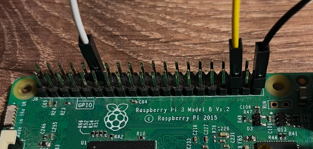

# Linux Sysfs PWM



This is a generic Linux userspace ArduPilot target for systems that expose PWM outputs through PWM sysfs.

## Motivation

The existing Linux boards that use the kernel PWM sysfs interface for RC
output (navio2, edge, canzero, t3-gem-o1) hard-code their PWM chip and
channel mapping in `HAL_Linux_Class.cpp` under their own board subtypes,
and each expects board-specific sensors at startup. There is no target for
running ArduPilot on a plain Linux system that exposes PWM through sysfs
without additional flight-controller hardware.

This target adds one generic subtype, `HAL_BOARD_SUBTYPE_LINUX_SYSFS_PWM`,
whose PWM chip and channel mapping are configured from the hwdef through
the `HAL_RCOUT_SYSFS_*` defines, so further sysfs PWM boards can be added
as hwdef-only changes without touching driver selection code.

## PWM outputs

The default mapping is:

| ArduPilot output | Linux sysfs path |
| ---------------- | ---------------- |
| SERVO1 | `/sys/class/pwm/pwmchip0/pwm0` |
| SERVO2 | `/sys/class/pwm/pwmchip0/pwm1` |

The operating system and device tree are responsible for exposing these PWM channels.

## RC input

No board-specific RC input hardware is configured by this target.

## Sensors

No board-specific IMU, barometer, compass, GPS, or airspeed sensor is
configured by this target. The target allows startup without a barometer.

## Testing

This target has been tested on a Raspberry Pi 3B running Raspberry Pi OS (trixie)
using the kernel hardware PWM driver. With a line in `/boot/firmware/config.txt`:

```text
dtoverlay=pwm-2chan
```

the kernel exposes PWM0 on GPIO18 and PWM1 on GPIO19 as
`/sys/class/pwm/pwmchip0/pwm0` and `pwm1`, matching the default mapping
above. Note that on a Raspberry Pi 5 the RP1 PWM controller may enumerate
as a different pwmchip number; adjust `HAL_RCOUT_SYSFS_CHIP` accordingly.

Build and run with:

```bash
./waf configure --board linux_sysfs_pwm
./waf rover
```
