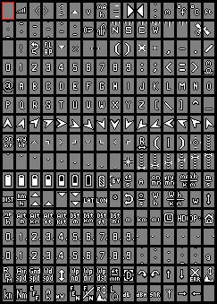
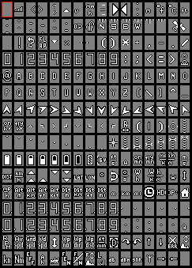

# Font styles

_The implementation of on-the-fly font style switching is still work in progress. As for now, there's a variety of font styles that can be chosen prior to building the code._

Credits to [inavosd](https://github.com/iNavFlight/inav-configurator/tree/master/resources/osd) for providing the basis to develop on.

Available font styles are:

**clarity (default)** a clearly visible large font:

  

**clarity_medium** good visibility, less dominant than clarity default:


**bfstyle** bf- / inav-osd default style: 



**bold** a bolder version of bfstyle:


**digital** 80's clock radio style:




## Individualizing charsets ##

Charsets can be edited or built form scratch using [MAX7456charwizard](https://github.com/diydrones/MinimOSD-Extra/blob/master/Tools/MAX7456Charwizard.jar)


## Building a firmware with a non-default font style

_On-the-fly style switching being still-work-in progress, as for now it is required to convert the desired .mcm file to a file named clarity.bin that is automatically integrated into the build._

In your cloned repository navigate to this directory:
```
/ardupilot/libraries/AP_OSD/fonts
```
and call "mcm2bin.py input.mcm output.bin" to convert your chosen .mcm file:
```
./mcm2bin.py yourfont.mcm clarity.bin
```
Now navigate back to the directory root, configure and build for your desired board.
