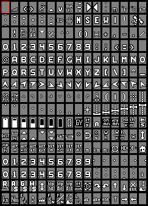

# Font styles

There are various font styles available to choose from. Credits to [inavosd](https://github.com/iNavFlight/inav-configurator/tree/master/resources/osd) for providing the basis to develop on. 

Font styles can be switched on-the-fly font style by setting parameter OSD_FONT to the desired number. This works for hardware backends as well as for SITL OSD.

Available styles and respective OSD_FONT numbers are:

**clarity (OSD_FONT 0, default)** a clearly visible large font:

  

**clarity_medium (OSD_FONT 1)** good visibility, less dominant than clarity default:



**bfstyle (OSD_FONT 2)** bf- / inav-osd default style: 


**bold (OSD_FONT 3)** a bolder version of bfstyle:


**digital (OSD_FONT 4)** 80's clock radio style:


## Adding font styles ##

Charsets can be edited or built form scratch using MAX7456Charwizard.jar included in this directory. Added charsets need to be converted to a binary file named fontN.bin prior to building the code. Files within this namespace will be automatically included in the build, so you can modify and replace existing .bin files or add your individual styles.

To do that, navigate to:
```
/ardupilot/libraries/AP_OSD/fonts
```
in your cloned repository and call:
```
./mcm2bin.py yourfont.mcm fontN.bin
```
to convert existent or added charsets into a binary. Now navigate back to the directory root, configure and build for your desired board.


## SD-card based font handling ##

Support for SD-card based font handling has been added with firmware version 4.1 and later. This adds the option to choose from up to 10 font files (named "font0.bin" - "font9.bin") placed in the root directory of your SD card. It allows to save memory especially on 1 MB boards by removing font binaries from the main firmware binary. Additionally, this allows the user to easily add individualized and/or customized language charsets for the onboard OSD without the need to compile  individual firmware. Runtime font changing using the parameter :ref:`OSD_FONT<OSD_FONT>` is unaffected. MAVftp might be a convenient option to upload files to your SD card without having to physically remove it from your flight controller.
