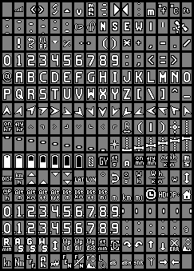
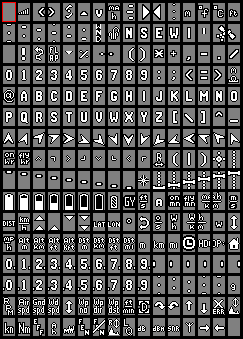

# Font styles

There are various font styles available to choose from. Credits to [inavosd](https://github.com/iNavFlight/inav-configurator/tree/master/resources/osd) for providing the basis to develop on. 

Font styles can be switched on-the-fly font style by setting parameter OSD_FONT to the desired number. This works for hardware backends as well as for SITL OSD.

Available styles and respective OSD_FONT numbers are:

**clarity (OSD_FONT 0, default)** a clearly visible large font:

  

**clarity_medium (OSD_FONT 1)** good visibility, less dominant than clarity default:


**bfstyle (OSD_FONT 2)** bf- / inav-osd default style: 


**bold (OSD_FONT 3)** a bolder version of bfstyle:



**digital (OSD_FONT 4)** 80's clock radio style:


## Adding font styles ##

Charsets can be edited or built form scratch using [MAX7456charwizard](https://github.com/diydrones/MinimOSD-Extra/blob/master/Tools/MAX7456Charwizard.jar). Added charsets need to be converted to a binary file named fontN.bin prior to building the code. Files within this namespace will be automatically included in the build, so you can modify and replace existing .bin files or add your individual styles.

To do that, navigate to:
```
/ardupilot/libraries/AP_OSD/fonts
```
in your cloned repository and call:
```
./mcm2bin.py yourfont.mcm fontN.bin
```
to convert existent or added charsets into a binary. Now navigate back to the directory root, configure and build for your desired board.
