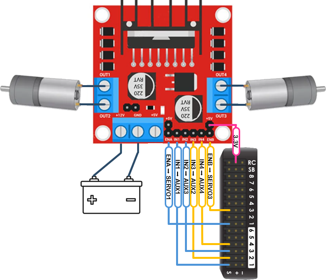

# Rover L298N Motor Driver

`rover-l298n.lua` provides support for L298N dual motor controller boards for Ackermann and skid steering configurations.

# How to Use

Install this script in the autopilot's SD card's APM/scripts directory. Set SCR_ENABLE to 1 and reboot the autopilot.

Once properly configured via the remainder of the instructions in this article, [Mission Planner's motor test function](https://ardupilot.org/rover/docs/rover-motor-and-servo-configuration.html#testing-motor-direction) can be used to verify correct operation.

Set the following motor parameters:

```
MOT_PWM_TYPE,3  # brushed with relay
MOT_PWM_FREQ,10 # see note
```

> *NOTE: Depending on the exact hardware in use on the controller board and/or motor response, it may help to set a lower PWM frequency. Most L298N boards should support 10kHz, as configured above.*

Set the remaining parameters based on the type of steering in use. Refer to the appropriate section below.

A wiring diagram is provided at the end of this article.

### Skid Steering:
---

Set the following servo output parameters:

```
SERVO1_FUNCTION,73  # ThrottleLeft
SERVO1_MIN,1000
SERVO1_TRIM,1000
SERVO1_MAX,2000
SERVO1_REVERSED,0
SERVO3_FUNCTION,74  # ThrottleRight
SERVO3_MIN,1000
SERVO3_TRIM,1000
SERVO3_MAX,2000
SERVO3_REVERSED,0
SERVO9_FUNCTION,-1  # GPIO
SERVO10_FUNCTION,-1 # GPIO
SERVO11_FUNCTION,-1 # GPIO
SERVO12_FUNCTION,-1 # GPIO
```

For typical autopilots, set the following relay parameters:


```
RELAY1_DEFAULT,0  # off
RELAY1_FUNCTION,5 # brushed motor reverse 1
RELAY1_PIN,50     # aux 1 pin (see note)
RELAY2_DEFAULT,0  # off
RELAY2_FUNCTION,6 # brushed motor reverse 2
RELAY2_PIN,51     # aux 2 pin (see note)
RELAY3_DEFAULT,0  # off
RELAY3_FUNCTION,1 # relay
RELAY3_PIN,52     # aux 3 pin (see note)
RELAY4_DEFAULT,0  # off
RELAY4_FUNCTION,1 # relay
RELAY4_PIN,53     # aux 4 pin (see note)
```

> *NOTE: Some autopilots may have differing GPIO pin numbering. Refer to the autopilot's documentation for more information.*

### Ackermann Steering:
---

Set the following servo output parameters:

```
SERVO1_FUNCTION,70  # Throttle (see note)
SERVO1_MIN,1000
SERVO1_TRIM,1000
SERVO1_MAX,2000
SERVO1_REVERSED,0
SERVO5_FUNCTION,26  # GroundSteering (see note)
SERVO9_FUNCTION,-1  # GPIO
SERVO11_FUNCTION,-1 # GPIO
```

> *NOTE: Due to firmware handling of brushed motors, SERVO1 should be used for Throttle in this configuration. Refer to the following note for steering output assignment.*

> *NOTE: When MOT_PWM_TYPE is configured as "brushed with relay," some output pins will become incompatible with normal servo output. SERVO5, as configured above for steering, should be safe for most typical installations. Refer to the GCS `RCOut` banner message to select an appropiate steering output pin. For example, the following message indicates that servo ouptuts 5 through 8 are available for assignment to the steering servo:*

`RCOut: Brush:1-4 PWM:5-8 Brush:13-14`

For typical autopilots, set the following relay parameters:

```
RELAY1_DEFAULT,0   # off
RELAY1_FUNCTION,5  # brushed motor reverse 1
RELAY1_PIN,50      # aux 1 pin (see note)
RELAY3_DEFAULT,0   # off
RELAY3_FUNCTION,1  # relay
RELAY3_PIN,52      # aux 3 pin (see note)
```

> *NOTE: Some autopilots may have differing GPIO pin numbering. Refer to the autopilot's documentation for more information.*

# Reversing Output

If one or both motors run in reverse when forward throttle is applied, reverse the motor leads for the respective motor.

Alternately, IN1 and IN2 can be swapped to reverse the left motor (or single motor, in the case of Ackermann steering), and IN3 and IN4 can be swapped to reverse the right motor.

*DO NOT* use `SERVOx_REVERSED` for this purpose.

# Wiring Diagram

The following diagram depicts typical wiring for a skid steering configuration.

Most autopilots use 3.3V GPIO and signal logic. Most L298N boards will accept either 3.3V or 5V as a logic reference voltage on the pin labeled `5V`. Recommend sourcing 3.3V from the autopilot to supply this pin (often found on the `SPKT` or `RCIN` port, among other places).

If the L298N board has isolated logic circuitry, provide a common ground between the board and the autopilot in additon to the high current power supply (battery) ground.

If the board in use has a jumper for supplying 3.3V or 5V power from its own onboard regulator, leave that jumper disconnected.

Refer to the L298N board's datasheet for more information.



> *NOTE: For Ackermann steering, connect ENA to SERVO1. Connect IN1 to AUX1 and IN2 to AUX3. Leave ENB, IN3, and IN4 disconnected.*

# Final Comments

The script uses the default brushed motor reverse relays (1 and 2). It then sets relays 3 and 4 to the inverse of the default relays for proper IN1-IN4 logic. IN1-IN4 are zeroed when disarmed to ensure motion control is disabled.

Thus, if a single motor is used, relays 1 and 3 are configured to control IN1 and IN2, and the Throttle output should be assiged to SERVO1.

This implementation frees AUX pins 5 and 6 for normal use, while providing full support for both Ackermann and skid steering configurations, in contrast to the [previously recommended configuration](https://github.com/jazzl0ver/ardupilot-rover-l298n).
