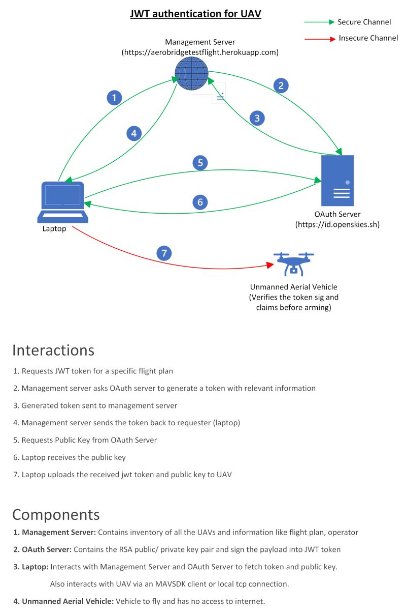
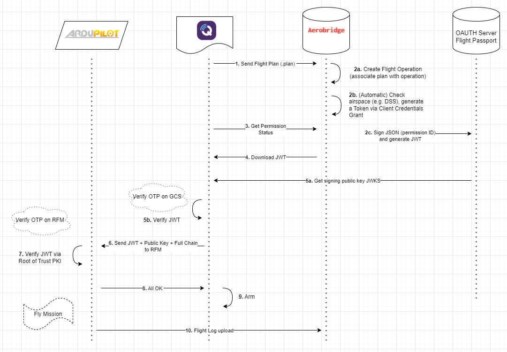
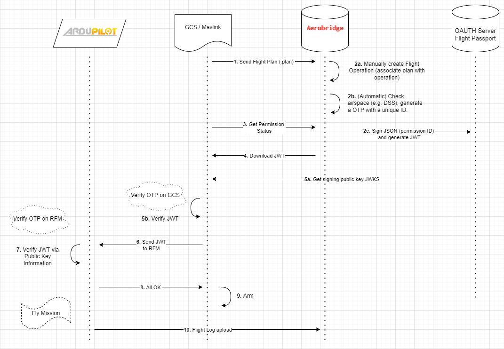

# Aerobridge Trusted Flight

## Introduction
This PR utilizes open standards (OAUTH and JWTs) to implement a basic flight permissioning mechanism. Conceptually the permissioning works in the following way: 
1. A JWT token issued against a operation and is sent to the vehicle via untrusted channel
2. The submodule then verifies the token signature and issue against parameters embedded in the firmware.
3. Based on the validity of the token, arming will be allowed/ disallowed 

All of the actions above can be done manually but for sake of convenience and standardizing these we use the Aerobridge Management server. The permission artifacts are issued by the Aerobridge Management Server. The server keeps track of data on missions, plans & operations and the associated permissions. In addition, Aerobridge has user management capabilities and an API to interact with the GCS that is utilized here. The sample script provides a demonstration how the API works.

Aerobridge Trusted Flight is a mechanism to transfer a "one time / time limited permission" via a JWT tokens to ArduPilot. We call this security layer as Trusted Flight. To enhance the security aspect of Trusted Flights, it's highly recommended to use secure bootloader by [Creating Tamperproof Firmware](https://ardupilot.org/dev/docs/secure-firmware.html). The following diagrams show how the mechanism of transferring and validating permission artifacts work:

1. Conceptual flow (Source: [Rhythm Chopra / LinkedIn](https://www.linkedin.com/posts/rhythm-chopra-923667102_authentication-security-opensource-activity-7035557389210644480-Hs3B))
    <p align="center">
        
    </p>

2. Basic flow with the management server
    <p align="center">
        
    </p>
3. Preflight checks -> Transfers the JWT token from Aerobridge Management Server which issues the flight permission to the GCS.
4. Flow with management server
    <p align="center">
        
    </p>

## Pre-requisites
The limitation of protection provided by Trusted Flight layer entirely rely on the security of the hardware. **_The firmware needs to be trusted and signed_** to prevent any tampering with the Trusted Flight validation workflow and ensure root of trust. 

## Pre-flight checks script
The [preflight checks python script](pre_flight_checks_load_operation.py) communicates with the drone and the Aerobridge Management Server. You will need a working instance of Aerobridge Management Server, for this purpose we will use our [Aerobridge Testflight](https://aerobridgetestflight.herokuapp.com) the digital infrastructure helps in issuing the JWT associates it with a operation. You can of course do this by yourself by hand but Aerobridge provides a standard way to communicate and make these manual commands easy. 

In the backend in addition to Aerobridge Management server you will also need an OAUTH server, e.g. an instance of Flight Passport (or any other OAUTH server). The .env file will specify the end points to verify the public key data of the OAUTH server. To get support you can reach out to our Discord Channel via https://opensource.aerobridge.io

#### aerobridgetools.py 
This contains a helper class to communicate with the Aerobridge Management server to download PEM files

#### data_definitions.py
This defines Models for data downloaded from Aerobridge

#### pre_flight_checks_load_operation.py
A script to download the flight operation details and communicate with the drone

## Local testing
> [!CAUTION]
> Only intended for isolated testing. Not to use in real use-cases.
> In the read world scenario the public key should be embedded into the firmware and JWT Token will be provided by the Auth Server.

In order to understand the proof of concept and overall working of the Trusted Flights flow in an isolated manner without any interactions with Aerobridge Management Server or any external source, we provide a few helper scripts that can be used to generate public/ private keypair and token locally.


### Steps for testing trusted flights locally

#### Build and run SITL with Trusted Flights
1. Move into vehicle directory
    ```
    cd ArduCopter
    ../Tools/autotest/sim_vehicle.py --console --map --osd --enable-sitl-trusted-flight
    ```
2. Arm via console
    ```
    arm throttle
    ```

#### Run autotests
```
./Tools/autotest/autotest.py build.TrustedFlight test.TrustedFlight
```

#### Build and test Trusted Flights on CubeOrange
1. Build and upload firmware to CubeOrange
    ```
    cd libraries/AP_TrustedFlight/tools
    ./generate_key_and_token.py /tmp/trusted_flight
    cd /path/to/ardupilot/root
    ./waf clean
    ./waf configure --board CubeOrange --trusted-flight-issuer=test.cname --trusted-flight-key=/tmp/trusted_flight/key.pub
    ./waf --targets bin/arducopter --upload
    ```
2. Upload `/tmp/trusted_flight_test/token` to `/APM/trusted_flight` directory on CubeOrange
3. Arm the vehicle.

> [!NOTE]
> In case the token expires by the time you ARM the vehicle, you can override the TTL for the token and other parameters in [utils/constants.py](utils/constants.py) as per requirement

## More information
- For more information re the management server see blog post here: https://blog.openskies.sh/articles/aerobridge-trusted-flight/
- For technical introduction see these two blog posts: 
    - https://medium.com/@rhythm8/a-journey-to-offline-jwt-authentication-ebc7859f0246 
    - https://medium.com/@rhythm8/using-certificate-chain-of-trust-to-verify-jwt-offline-ab3d4c3f0322
