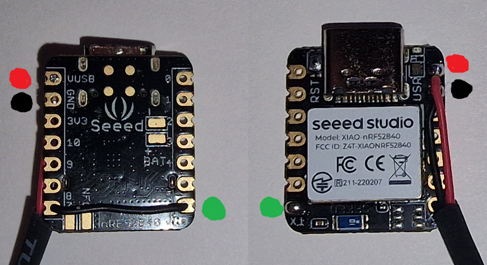
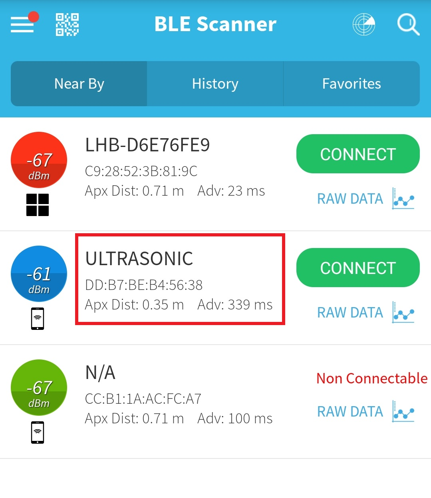
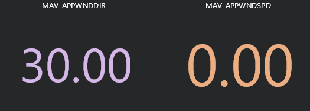

# Bluetooth to NMEA receiver

This script can be used with a Arduino compatible nRF52 Bluetooth module to receive wind readings from a CALYPSO Ultrasonic Portable Mini wind meter and output NMEA 0183 for use with ArduPilot. Such a sensor is smaller and lighter than typical sensors and removes the need to run cabling to the top of the mast.

## Hardware setup

Any Arduino compatible nRF52 Bluetooth board should work, this guide is written for a Seeed XIAO nRF52840 Sense. Three connections need to be made between the flight controller and XIAO. The image below shows the connections from both the top and bottom of the XIAO. 5v (Red), ground (black) and TX (green) to a serial port RX pin on the flight controller.



## Script setup

Follow the instructions from the manufacturer to setup the Arduino envoroment for your board. Install the [Adafruit nRF52](https://github.com/adafruit/Adafruit_nRF52_Arduino/tree/master/libraries/Bluefruit52Lib) library as outlined here: https://github.com/adafruit/Adafruit_nRF52_Arduino#bsp-installation.

Use a smartphone and blue tooth tool to find the adress of your windvane. On Android [BLE Scanner](https://play.google.com/store/apps/details?id=com.macdom.ble.blescanner&hl=en_GB&gl=US) can be used, although there are many equivalent apps.

Locate the wind-vane and note down its address, in this case `DD:B7:BE:B4:56:38`.



Take your the address and replace the one at the top of the script, removing colons and pre-fixing `0x` to denote a hexadecimal value. For example:
```
#define WIND_VANE_ADDRESS 0xDDB7BEB45638
```

Save the script and flash it to your nRF52 board. The LED will be red if no connection can be made it will go green once a connection has been established, this can take a few seconds. If the green LED is solid and the red LED flashing it is connected but the wind-vane has less than 25% battery remaining, it will go into low power mode once it reaches 20%.

Note! The wind-vane can only accept one connection at a time, if you cann't connect make sure nothing else is connected to the wind-vane.

## ArduPilot setup

The Arduino script is setup to output NMEA 0183 messages as they are already supported by ArduPilot.

Enable NMEA wind-vane with:
```
WNDVN_TYPE 4
WNDVN_SPEED_TYPE 4
```
Setup the serial port you have connected the nRF52 to with:
```
SERIALx_PROTOCOL 21
SERIALx_BAUD 57
```

After a re-boot you should see wind messages reported to the GCS. For example `MAV_APPWNDDIR` and `MAV_APPWNDSPD` can be selected in mission planner to display the apparent wind direction and speed.



## Future work

The script does send back the battery level of the wind-vane formatted as a NMEA `XDR` message. Some ArduPilot changes are required to allow this value to be parsed and displayed.


