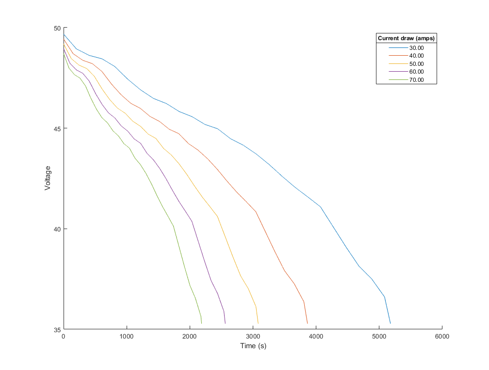

# Testing SITL battery model

This example allows the built in battery model to be evaluated. The battery is defined by the parameters in a json configuration file, such as [this one](../../../../Tools/autotest/models/Callisto.json).

The example only works with the linux target. Configure and build with:

```
./waf configure --board linux
./waf build --targets examples/EvaluateBatteryModel
```

The example can then be run, the first argument is the path to the json model definition. The second is the constant current draw to apply.

The command:

```
./build/linux/examples/EvaluateBatteryModel Tools/autotest/models/Callisto.json 50
```

Gives the output:
```
Loading model Tools/autotest/models/Callisto.json
Loaded model params from Tools/autotest/models/Callisto.json
Simulating 50.40v, 44.00 ah battery with resistance of 0.024000
Voltage from 50.40 to 35.28 with constant current draw of 50.00
time, voltage
0.00, 49.20
0.05, 49.20
0.10, 49.20
0.15, 49.20
0.20, 49.20
0.25, 49.20
0.30, 49.20
....
...
```

This can be output re-directed to a file with:
```
./build/linux/examples/EvaluateBatteryModel Tools/autotest/models/Callisto.json 50 >> battery_test.csv
```

The data can then be compared to real battery data and the model definition changed to better represent the vehicle being modelled.



