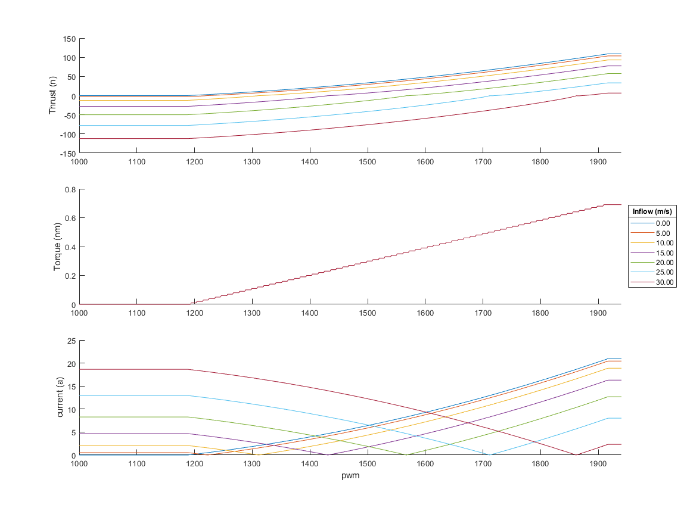

# Testing SITL motor model

This example allows the built in motor/prop model to be evaluated. The motor is defined by the parameters in a json configuration file, such as [this one](../../../../Tools/autotest/models/Callisto.json).

The example only works with the linux target. Configure and build with:

```
./waf configure --board linux
./waf build --targets examples/EvaluateMotorModel
```

The example can then be run, the first argument is the path to the json model definition. The second and third argument specify the inflow velocity (m/s) and voltage respectively.

The command:

```
./build/linux/examples/EvaluateMotorModel Tools/autotest/models/Callisto.json 0 50
```

Gives the output:
```
Loading model Tools/autotest/models/Callisto.json
Loaded model params from Tools/autotest/models/Callisto.json
Motors at 50.00v with 0.00 m/s inflow
time, PWM, thrust, torque, current
0.00, 1000, 0.00, 0.00, 0.00
0.05, 1001, 0.00, 0.00, 0.00
0.10, 1002, 0.00, 0.00, 0.00
0.15, 1003, 0.00, 0.00, 0.00
0.20, 1004, 0.00, 0.00, 0.00
0.25, 1005, 0.00, 0.00, 0.00
0.30, 1006, 0.00, 0.00, 0.00
0.35, 1007, 0.00, 0.00, 0.00
0.40, 1008, 0.00, 0.00, 0.00
0.45, 1009, 0.00, 0.00, 0.00
0.50, 1010, 0.00, 0.00, 0.00
0.55, 1011, 0.00, 0.00, 0.00
0.60, 1012, 0.00, 0.00, 0.00
...
```

This can be output re-directed to a file with:
```
./build/linux/examples/EvaluateMotorModel Tools/autotest/models/Callisto.json 0 50 >> motor_test.csv
```

The data can then be compared to real thrust data and the model definition changed to better represent the vehicle being modelled.



